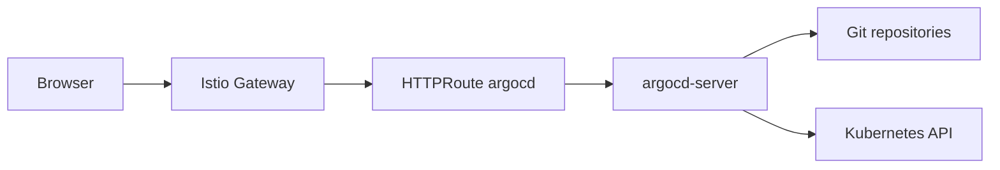

# argocd

Installs Argo CD for GitOps delivery and exposes it through an existing Gateway
API Gateway.

## Components

- `argocd` namespace with optional Istio ambient label
- Argo CD Helm release
- HTTPRoute for `argocd.<domain>`
- ServiceEntry for the public Argo CD hostname
- resource requests and limits tuned for small Always Free clusters

## Access Flow



The module runs `argocd-server` with `server.insecure=true` because TLS is
terminated at the shared Istio Gateway.

## Example

```hcl
module "argocd" {
  source = "../modules/argocd"

  enabled           = true
  host              = "argocd.example.com"
  gateway_name      = module.platform.gateway_name
  gateway_namespace = module.platform.gateway_namespace
  kubeconfig_path   = "~/.kube/config"
}
```

## Initial Login

Use the built-in admin account only for bootstrap:

```bash
kubectl -n argocd get secret argocd-initial-admin-secret \
  -o jsonpath='{.data.password}' | base64 -d
```

After the Keycloak module is enabled, Argo CD should move to OIDC and the
built-in admin account can be disabled.

## Related Documents

- [Module library README](../../README.md)
- [Platform module](../platform/README.md)
- [Consumer architecture](../../../oci-oke-always-free/docs/architecture.md)
- [Consumer usage guide](../../../oci-oke-always-free/docs/manual-de-uso.md)

## References

- [Argo CD documentation](https://argo-cd.readthedocs.io/)
- [Argo CD Helm chart](https://github.com/argoproj/argo-helm/tree/main/charts/argo-cd)
- [Argo CD SSO](https://argo-cd.readthedocs.io/en/stable/operator-manual/user-management/)
