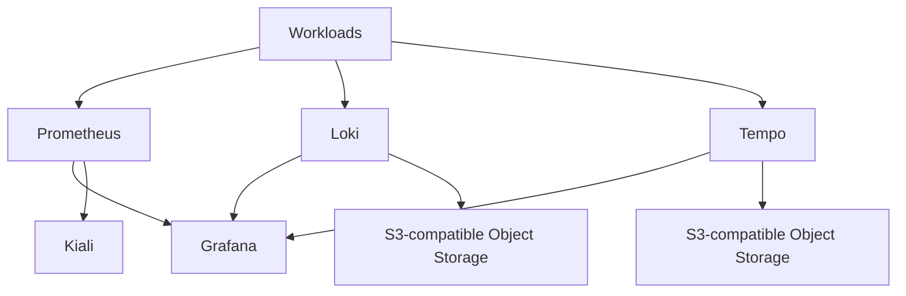
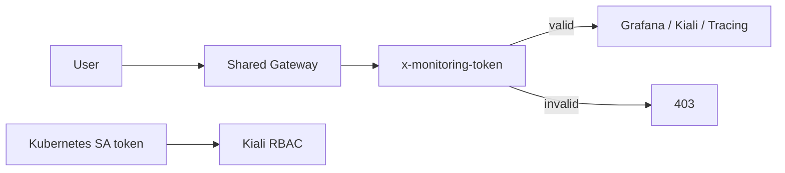

# observability

Installs the observability layer and exposes dashboards through an existing
Gateway API Gateway.

## Components

- Kiali with token authentication
- kube-prometheus-stack with Grafana and Prometheus
- Loki for logs
- Tempo for traces
- optional legacy Jaeger all-in-one
- HTTPRoutes for Kiali, Grafana, and tracing
- Istio AuthorizationPolicy that requires a shared `x-monitoring-token` header
- admin and read-only ServiceAccounts for Kiali token login
- optional Grafana anonymous Viewer mode behind the shared Gateway token

## Storage



Loki and Tempo are configured for S3-compatible object storage, which works with
OCI Object Storage customer secret keys. This avoids consuming block volume
capacity for logs and traces.

Prometheus can use a PVC with short retention. Grafana persistence is disabled
by default so Always Free block volume capacity remains available for workloads.

## Example

```hcl
module "observability" {
  source = "../modules/observability"

  gateway_name      = module.platform.gateway_name
  gateway_namespace = module.platform.gateway_namespace
  kubeconfig_path   = "~/.kube/config"
  monitoring_token  = random_password.monitoring_token.result

  hosts = {
    kiali   = "kiali.example.com"
    grafana = "grafana.example.com"
    tracing = "tracing.example.com"
  }

  loki_storage = {
    endpoint          = module.observability_storage.s3_endpoint
    region            = "us-phoenix-1"
    bucket_name       = module.observability_storage.buckets.loki.name
    access_key_id     = module.observability_storage.customer_secret_access_key_id
    secret_access_key = module.observability_storage.customer_secret_access_key
  }

  tempo_storage = {
    endpoint          = module.observability_storage.s3_endpoint
    region            = "us-phoenix-1"
    bucket_name       = module.observability_storage.buckets.tempo.name
    access_key_id     = module.observability_storage.customer_secret_access_key_id
    secret_access_key = module.observability_storage.customer_secret_access_key
  }
}
```

## Access



Requests must include:

```text
x-monitoring-token: <monitoring_token>
```

Kiali still requires a Kubernetes ServiceAccount token when
`kiali_auth_strategy="token"`. The module can create:

- `kiali-admin`, bound to `cluster-admin`
- `kiali-readonly`, bound to the Kiali viewer ClusterRole

Grafana admin login uses the configured admin password. Read-only Grafana access
can be provided through anonymous Viewer mode, but only after the request passes
the shared Gateway token policy.

## References

- [Kiali token authentication](https://kiali.io/docs/configuration/authentication/token/)
- [Kiali architecture](https://kiali.io/docs/architecture/architecture/)
- [Grafana provisioning](https://grafana.com/docs/grafana/latest/administration/provisioning/)
- [Grafana Loki storage](https://grafana.com/docs/loki/latest/configure/storage/)
- [Grafana Tempo](https://grafana.com/docs/tempo/latest/)
