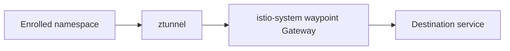
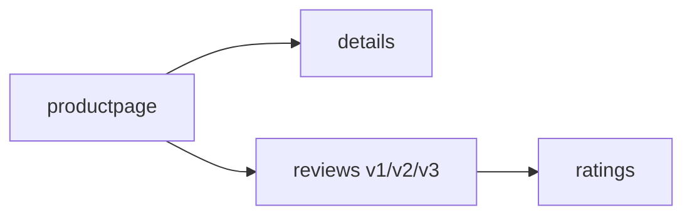

# platform

Installs the shared Kubernetes platform layer for an OCI OKE cluster.

## Components

- Gateway API CRDs
- cert-manager
- optional OCI DNS01 cert-manager webhook
- external-dns
- Metrics Server
- Istio ambient mode
- public Istio ingress gateway backed by an OCI Network Load Balancer
- optional wildcard TLS certificate and HTTPS Gateway listener
- optional shared ambient waypoint in the Istio root namespace
- optional Istio Bookinfo sample in the `default` namespace

## Inputs

The caller must provide the base domain, ACME email, OCI region, compartment
OCID, kubeconfig path, and public ingress allowlist. Keep environment-specific
values in the root module, not in this module.

Example:

```hcl
module "platform" {
  source = "../modules/platform"

  domain_name                  = "example.com"
  acme_email                   = "admin@example.com"
  compartment_ocid             = module.foundation.compartment_ocid
  region                       = "us-phoenix-1"
  kubeconfig_path              = "~/.kube/config"
  public_gateway_allowed_cidrs = ["203.0.113.10/32"]
  enable_wildcard_certificate  = true
}
```

## DNS and TLS

When `enable_wildcard_certificate=true`, the module creates a ClusterIssuer and
a wildcard Certificate for `*.domain_name`. The HTTPS Gateway listener is applied
only after the certificate is ready.

The OCI DNS01 webhook expects the OKE nodes to have permission to manage TXT
records in the target zone, typically through instance principal policies.

## Outputs

The module returns the Gateway name, Gateway namespace, Istio namespace, Gateway
Service name, wildcard secret name, and optional Bookinfo URL so root modules
can wire DNS records and observability routes.

## ExternalDNS and HTTPRoutes

By default, `external_dns_sources=["service", "gateway-httproute"]`. The root
module should annotate the public Gateway with
`external-dns.alpha.kubernetes.io/target=<public-nlb-ip>` when OCI reports both
private and public Gateway addresses. Application HTTPRoutes can then create DNS
records automatically.

## Central waypoint



Set `enable_central_egress_waypoint=true` to create a shared waypoint Gateway in
`istio-system`. Namespaces listed in `central_egress_waypoint_namespaces` are
labeled for ambient mode and configured to use the cross-namespace waypoint.

This follows the Istio ambient waypoint model: the waypoint is a Kubernetes
Gateway with `gatewayClassName: istio-waypoint`, and enrolled namespaces use the
`istio.io/use-waypoint` and `istio.io/use-waypoint-namespace` labels.

## Bookinfo sample



Set `enable_bookinfo_sample=true` to install the Istio Bookinfo lab application
in the `default` namespace. Set `enable_bookinfo_route=true` to publish
`https://bookinfo.<domain>/productpage` through the shared Gateway without
creating a separate LoadBalancer.

## Related Documents

- [Module library README](../../README.md)
- [OKE platform example](../../examples/oke-platform/README.md)
- [Consumer architecture](../../../oci-oke-always-free/docs/architecture.md)
- [Consumer usage guide](../../../oci-oke-always-free/docs/manual-de-uso.md)
- [Observability module](../observability/README.md)

## References

- [Istio ambient waypoint proxies](https://istio.io/latest/docs/ambient/usage/waypoint/)
- [Istio Bookinfo sample](https://istio.io/latest/docs/examples/bookinfo/)
- [Gateway API](https://gateway-api.sigs.k8s.io/)
- [ExternalDNS Gateway API source](https://kubernetes-sigs.github.io/external-dns/v0.21.0/docs/sources/gateway-api/)
- [cert-manager DNS01 webhook solver](https://cert-manager.io/docs/configuration/acme/dns01/webhook/)
